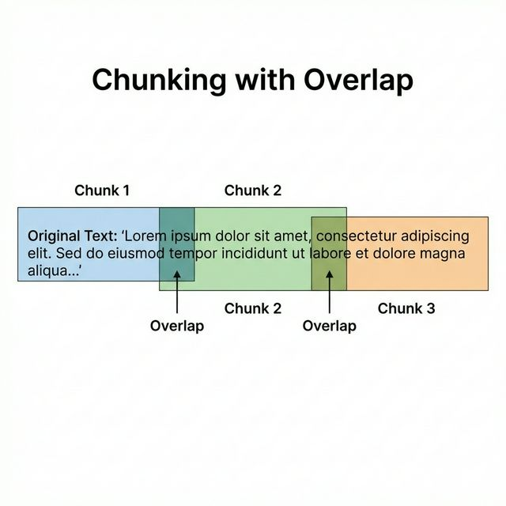

# 1. A Base: IA Generativa e o Controle Inicial (Prompt Engineering)

- No início, o grande desafio da TI foi entender e controlar os Modelos de Linguagem (LLMs), que diferem drasticamente da programação tradicional.
- **Determinístico vs. Probabilístico**: 
  - A **programação clássica (if/else)** é **determinística**, sempre gerando o mesmo resultado.
  - Já a **IA Generativa** atua de forma **probabilística**, calculando qual é a próxima palavra mais provável, o que pode causar "alucinações" (inventar fatos para agradar o usuário).
- **Parâmetros de Controle**: Para cenários que exigem precisão (como aplicações jurídicas ou policiais), ajustamos a **Temperatura do modelo para 0.0**, tornando-o mais focado e menos "criativo".
  - `Temperatura` Controla a aleatoriedade da resposta. Valores baixos (0.0-0.3) geram respostas mais previsíveis e conservadoras. Valores altos (0.7-1.0) geram respostas mais criativas e diversas.
- **Prompt Engineering**: É a arte de "programar em linguagem natural", ensinando a IA a raciocinar. As técnicas evoluíram na seguinte sequência:

### Tabela Comparativa das Técnicas de Prompt Engineer

| Técnica | Melhor para | Complexidade | Quando usar |
| :--- | :--- | :--- | :--- |
| **Zero-Shot** | Perguntas simples | ⭐ | "Qual a capital da França?" |
| **Few-Shot** | Padrões definidos | ⭐⭐ | Classificação, formatação |
| **Chain of Thought** | Raciocínio lógico | ⭐⭐⭐ | Problemas matemáticos |
| **Tree of Thoughts** | Múltiplas hipóteses | ⭐⭐⭐⭐ | Planejamento estratégico |
| **React** | Interação com ferramentas | ⭐⭐⭐ | Agentes com ações |
| **Self-Consistency** | Alta precisão | ⭐⭐⭐ | Validação de respostas |
| **Self-Reflection** | Refinamento | ⭐⭐⭐ | Revisão de textos |
| **APE** | Otimização de prompts | ⭐⭐⭐⭐ | Quando não sabe o prompt |
| **Emotion** | Melhor performance | ⭐⭐ | Tarefas criativas |
| **Skeleton** | Textos longos | ⭐⭐⭐ | Artigos, relatórios |
| **Generated Knowledge** | Tópicos nichados | ⭐⭐⭐ | Respostas técnicas |

- `Zero-Shot`:
  - **Explicação:** Técnica onde o modelo recebe uma instrução ou pergunta direta sem nenhum exemplo prévio de como a resposta deve ser formatada ou estruturada.
  - **Analogia:** É como pedir para um estranho na rua resolver um enigma sem dar nenhuma dica de como você prefere receber a resposta.
  - **Quando usar:**
    - Perguntas factuais simples e diretas.
    - Traduções rápidas de termos.
    - Resumos de textos curtos e sem padrão específico.

  **Exemplo Prático:**

  ```python
  prompt_zero = "Classifique o sentimento deste texto: 'O dia está maravilhoso!'"
  ```

- `Few-Shot`:
  - **Explicação:** Consiste em fornecer alguns exemplos (shots) de pares entrada/saída antes de fazer a solicitação final, "ensinando" o padrão desejado ao modelo.
  - **Analogia:** É como mostrar para um estagiário três exemplos de relatórios preenchidos corretamente antes de pedir que ele faça o quarto sozinho seguindo o mesmo padrão.
  - **Quando usar:**
    - Classificações complexas que exigem um vocabulário específico (ex: jurídico).
    - Extração de dados em formatos JSON ou tabelas customizadas.
    - Imitação de tom de voz ou estilo de escrita específico.

  **Exemplo Prático:**

  ```python
  prompt_few = """
  Mensagem: 'Amei o produto' | Status: Positivo
  Mensagem: 'Chegou quebrado' | Status: Negativo
  Mensagem: 'Entrega demorada' | Status:
  """
  ```

- `Chain of Thought (CoT)`:
  - **Explicação:** Uma técnica de "Cadeia de Pensamento" que força o modelo a gerar passos intermediários de raciocínio lógico antes de apresentar a conclusão final.
  - **Analogia:** É como um professor de matemática que exige que você mostre todo o desenvolvimento do cálculo passo a passo, e não aceite apenas o resultado final.
  - **Quando usar:**
    - Problemas lógicos e desafios matemáticos.
    - Tomadas de decisão que exigem uma justificativa técnica.
    - Redução de alucinações em tarefas que exigem múltiplos passos de validação.

  **Exemplo Prático:**

  ```python
  prompt_cot = """
  Problema: Se eu tenho 10 laranjas, dou 3 para Maria e 2 para João, mas depois compro mais 5. 
  Quantas laranjas eu tenho agora? 
  Vamos pensar passo a passo para garantir a precisão.
  """
  ```

- `Self-Reflection`:
  - **Explicação:** Técnica onde o modelo gera uma primeira versão da resposta, avalia criticamente o próprio resultado em busca de erros ou melhorias, e então gera uma versão refinada.
  - **Analogia:** É como um escritor que escreve o primeiro rascunho de um capítulo, faz uma autocrítica severa e então reescreve o texto para deixá-lo perfeito.
  - **Quando usar:**
    - Geração de código complexo (debugging automatizado).
    - Escrita criativa e redação de artigos longos.
    - Verificação de consistência em fatos e datas.

  **Exemplo Prático:**

  ```python
  prompt_reflection = """
  Tarefa: Escreva um código Python para ordenar uma lista.
  Após escrever, revise o código em busca de erros de sintaxe ou ineficiências e apresente a versão otimizada final.
  """
  ```

- `Tree of Thought (ToT)`:
- **Explicação:** O Tree of Thoughts (Árvore de Pensamentos) é uma evolução do Chain of Thought. Enquanto o CoT segue um **único caminho linear** de raciocínio, o ToT explora **MÚLTIPLOS caminhos** de pensamento simultaneamente, como galhos de uma árvore.
- **Analogia:** Imagine que você está resolvendo um problema de matemática. O CoT seria você seguir um único caminho de resolução. O ToT seria você considerar várias abordagens diferentes ao mesmo tempo, avaliando qual parece mais promissora, podendo voltar atrás se um caminho não funcionar.

- Quando usar:
  - Problemas complexos que exigem exploração de múltiplas hipóteses
  - Tarefas de planejamento estratégico
  - Resolução de problemas com múltiplas soluções possíveis
  - Debugging de código complexo
  - Tomada de decisão com múltiplas variáveis

  **Exemplo Prático:**

  ```python
  prompt_ToT = """
  Problema: Precisamos criar uma estratégia para reduzir o desperdício de alimentos em um restaurante.

  Vamos explorar múltiplas abordagens:

  PENSAMENTO 1 (Abordagem Operacional):
  - Raciocínio: Otimizar compras baseado em histórico
  - Vantagens: Reduz compras excessivas
  - Desvantagens: Pode faltar em dias movimentados
  - Viabilidade: Alta

  PENSAMENTO 2 (Abordagem Tecnológica):
  - Raciocínio: Implementar sistema de previsão de demanda com IA
  - Vantagens: Precisão baseada em dados
  - Desvantagens: Custo de implementação
  - Viabilidade: Média (requer investimento)

  PENSAMENTO 3 (Abordagem Social):
  - Raciocínio: Parceria com apps de comida para vender excedentes
  - Vantagens: Gera receita extra, reduz desperdício
  - Desvantagens: Logística de entrega
  - Viabilidade: Alta

  Agora, analise estes pensamentos e:
  1. Identifique pontos em comum
  2. Combine as melhores ideias
  3. Proponha uma solução híbrida integrando múltiplas abordagens
  """
  ```

- `Chain of Density`:
  - **Explicação:** Técnica para criar resumos progressivamente mais densos e informativos. O modelo começa com um resumo básico e, através de múltiplas iterações, substitui palavras excessivas por novas entidades (fatos, dados, nomes) sem aumentar o tamanho do texto, tornando-o extremamente rico em informação.
  - **Analogia:** É como fazer uma mala para uma viagem longa. Primeiro você coloca o básico. Depois, percebe que sobrou espaço e substitui um moletom grande por três camisetas e um par de meias. Você continua otimizando o espaço até que a mala tenha tudo o que você precisa sem ficar mais pesada.

  - **Quando usar:**
    - Resumo de documentos longos e complexos.
    - Extração de entidades e fatos em espaço limitado.
    - Criação de versões executivas concisas mas tecnicamente completas.
    - Preparação de datasets densos para fine-tuning.

  **Exemplo Prático:**

  ```python
  prompt_CoD = """
  Texto original: [Um artigo longo sobre mudanças climáticas]

  ITERAÇÃO 1 (Resumo básico - 50 palavras):
  "Mudanças climáticas são causadas por emissões de CO2. Isso leva a aumento de temperatura, derretimento de geleiras e eventos climáticos extremos. Cientistas alertam para a necessidade de redução de emissões."

  ITERAÇÃO 2 (Mais denso - 50 palavras):
  "Emissões antrópicas de CO2, principalmente de combustíveis fósseis, intensificam o efeito estufa. Consequências: aumento de 1.2°C na temperatura global, aceleração do derretimento de geleiras polares, e maior frequência de furacões e secas."

  ITERAÇÃO 3 (Máxima densidade - 50 palavras):
  "Queima de combustíveis fósseis desde Revolução Industrial elevou CO2 atmosférico em 50%. Aquecimento resultante de 1.2°C já causa derretimento acelerado na Groenlândia (perda de 280 bilhões ton/ano), acidificação oceânica, e eventos extremos 3x mais frequentes."

  Agora crie uma ITERAÇÃO 4 com ainda MAIS informações específicas (dados, números, exemplos concretos) mantendo 50 palavras.
  """
  ```

- `React`:
  - **Explicação:** Combina o raciocínio verbal (Reasoning) com a execução de ações (Acting). O modelo gera um pensamento, executa uma ação (como uma busca ou cálculo) e observa o resultado antes de prosseguir.
  - **Analogia:** É como um investigador particular que anota suas deduções em um caderno, mas para para fazer uma ligação ou consultar um arquivo sempre que precisa de uma informação que não tem de cabeça.
  - **Quando usar:**
    - Agentes autônomos que utilizam ferramentas externas (API, Google Search).
    - Tarefas que exigem verificação de fatos em tempo real.
    - Problemas que exigem cálculos complexos fora da capacidade da LLM.

  **Exemplo Prático:**

  ```python
  prompt_react = """
  Você é um assistente que pode pesquisar na web e calcular.
  Resolva: "Qual a população do Brasil dividida pela população de Portugal?"

  PASSO 1 (Raciocínio):
  Preciso primeiro encontrar as populações de ambos os países.

  AÇÃO 1: [PESQUISAR] "população do Brasil 2024"
  OBSERVAÇÃO: Brasil tem aproximadamente 216 milhões de habitantes

  PASSO 2 (Raciocínio):
  Agora preciso da população de Portugal.

  AÇÃO 2: [PESQUISAR] "população de Portugal 2024"
  OBSERVAÇÃO: Portugal tem aproximadamente 10.3 milhões de habitantes

  PASSO 3 (Raciocínio):
  Agora preciso dividir 216 por 10.3

  AÇÃO 3: [CALCULAR] 216 / 10.3
  OBSERVAÇÃO: Resultado = 20.97

  RESPOSTA FINAL: A população do Brasil é aproximadamente 21 vezes maior que a de Portugal.
  """
  ```
  

- `Self-Consistency`:
  - **Explicação:** O modelo gera múltiplos caminhos de raciocínio (várias "correntes de pensamento") para a mesma pergunta e seleciona a resposta que aparece com mais frequência (voto de maioria).
  - **Analogia:** É como pedir para 5 engenheiros calcularem a carga de uma ponte separadamente. Se 4 chegarem ao mesmo número, você tem muito mais confiança nesse resultado do que se tivesse perguntado a apenas um.
  - **Quando usar:**
    - Problemas matemáticos onde uma pequena falha no meio do caminho altera o resultado final.
    - Tarefas de lógica onde o modelo tende a ser instável.
    - Quando a precisão é muito mais importante que a velocidade/custo.

  **Exemplo Prático:**

  ```python
  prompt_sc = "Resolva o problema X três vezes, mostrando o raciocínio em cada uma. Ao final, indique a resposta mais consistente."
  ```

- `APE (Automatic Prompt Engineer)`:
  - **Explicação:** Utiliza uma LLM para gerar, analisar e selecionar automaticamente o prompt mais eficiente para realizar uma tarefa específica, otimizando a performance sem intervenção humana constante.
  - **Analogia:** É como um treinador de atletas que testa várias técnicas de treinamento diferentes e usa dados de performance para decidir qual delas faz o time correr mais rápido.
  - **Quando usar:**
    - Otimização de prompts em escala.
    - Quando você tem os dados (input/output) mas não sabe como escrever a instrução ideal para a IA.

  **Exemplo Prático:**

  ```python
  prompt_ape = """
  Preciso de um prompt que faça a IA agir como um tutor de matemática para crianças de 10 anos.
  Gere 5 variações diferentes de prompts, cada uma com uma abordagem única:

  PROMPT 1 (Abordagem Lúdica):
  "Você é o Professor Matemágico, um tutor que transforma problemas de matemática em aventuras divertidas. Use analogias com brinquedos, doces e jogos para explicar conceitos."

  PROMPT 2 (Abordagem Passo-a-Passo):
  "Você é um tutor paciente que NUNCA dá a resposta direta. Sempre guie a criança com perguntas: 'O que você acha?', 'Como podemos começar?', 'Que tal tentarmos juntos?'"

  PROMPT 3 (Abordagem Visual):
  "Você é um tutor que usa descrições vívidas para criar imagens mentais. Para frações, descreva pizzas sendo divididas. Para geometria, descreva formas no mundo real."

  PROMPT 4 (Abordagem de Reforço):
  "Você é um tutor encorajador que celebra cada pequeno acerto com emojis e palavras positivas. Use 'Excelente!', 'Quase lá!', 'Você consegue!' frequentemente."

  PROMPT 5 (Abordagem Prática):
  "Você é um tutor que conecta matemática ao dia-a-dia: 'Se você tem 10 reais e quer comprar balas de 2 reais, quantas pode comprar?' Use situações reais."

  Agora, analise cada abordagem e crie um PROMPT FINAL que combine os melhores elementos de todos.
  """
  ```

- `Emotion`:
  - **Explicação:** Adiciona estímulos emocionais ou frases de urgência/relevância social ao prompt que parecem "motivar" o modelo a prestar mais atenção e evitar preguiça computacional.
  - **Analogia:** É como dizer para um funcionário: "Este relatório é fundamental para o futuro da empresa e muitas pessoas dependem dele", em vez de apenas dizer "Faça este relatório".
  - **Quando usar:**
    - Quando o modelo está dando respostas muito curtas ou simplórias.
    - Tarefas criativas que exigem mais "esforço" lírico.
    - Situações onde a precisão crítica é vital.

  **Exemplo Prático:**

  ```python
  prompt_emotion = "Isto é muito importante para a minha carreira. Analise cuidadosamente este contrato e não deixe passar nenhum detalhe."
  ```

- `Skeleton`:
  - **Explicação:** O modelo é instruído a criar primeiro o "esqueleto" (tópicos principais) da resposta e depois expandir cada um dos pontos detalhadamente.
  - **Analogia:** É como escrever uma redação começando pelo sumário ou tópicos principais, garantindo que você não esqueceu nada importante antes de começar a escrever o texto final.
  - **Quando usar:**
    - Produção de artigos longos, relatórios técnicos ou documentações.
    - Garantia de que a resposta será abrangente e estruturada.

  **Exemplo Prático:**

  ```python
  prompt_skeleton = """
  1. Crie um esqueleto de tópicos para um artigo sobre IA na medicina.
  2. Agora, escreva um parágrafo detalhado para cada tópico do esqueleto.
  """
  ```

- `Generated Knowledge`:
  - **Explicação:** Solicita que o modelo gere fatos e conhecimentos sobre um tema específico antes de tentar responder a uma pergunta sobre esse tema, garantindo que o contexto relevante esteja ativo.
  - **Analogia:** É como pedir para um estudante escrever tudo o que ele lembra sobre a Revolução Francesa em um rascunho antes de começar a responder as perguntas dissertativas da prova.
  - **Quando usar:**
    - Perguntas sobre temas nichados ou muito técnicos.
    - Quando o modelo precisa de "contexto fresco" para evitar confusão com temas parecidos.

  **Exemplo Prático:**

  ```python
  prompt_gk = """
  Gere 5 fatos sobre a arquitetura de Vision Transformers. 
  Agora, com base nesses fatos, explique por que o ViT é eficiente em imagens de alta resolução.
  """
  ```

- `Multimodalidade` A evolução permitiu acoplar modelos de Visão Computacional (ex: Vision Transformers), capacitando a IA a "ler" imagens como se fossem texto.

## 2. A Revolução do Contexto: O Nascimento do RAG Clássico

- Os LLMs, apesar de poderosos, nasceram com duas limitações críticas que o RAG surge para resolver.

### **O Problema da Amnésia e Desatualização**

#### 1. Janela de Contexto (A Mesa de Trabalho)

- **Explicação**: Janela de Contexto é o limite de memória da IA. Tudo o que o modelo processa em uma única interação deve caber aqui.
- **Analogia**: Imagine que o LLM é um escritório e a **Janela de Contexto** é a sua mesa de trabalho. Se a mesa estiver cheia, você não consegue abrir novos processos sem fechar os antigos.
- **Limitações Reais**:
  - **Modelos Antigos (GPT-3)**: ~6 páginas de texto.
  - **Modelos Médios (GPT-3.5)**: ~24 páginas de texto.
  - **Modelos Novos (GPT-4 Turbo)**: ~300 páginas.
- **O Desafio**: Documentações técnicas gigantescas ou livros inteiros (ex: 500 páginas) ainda extrapolam a maioria das janelas de contexto atuais.

#### 2. Corte de Conhecimento (Knowledge Cutoff)

- **Explicação**: A base de fatos da IA é estática, limitada à data final de seu treinamento.
- **Analogia**: É como um gênio que leu todos os livros do mundo, mas está trancado em uma biblioteca sem internet desde o ano passado. Ele é inteligentíssimo, mas não sabe quem ganhou o Oscar ontem.
- **Custo de Atualização**:
  - **Retreinamento**: Custa milhões de dólares e meses de trabalho.
  - **RAG**: Atualiza apenas o banco de dados em minutos por um custo irrisório.

---

### **A Solução: RAG (Retrieval-Augmented Generation)**

- O RAG transforma a IA de um "gênio isolado" em um "escritor com acesso a uma biblioteca infinita".

#### **O Fluxo de Trabalho (Arquitetura em 2 Fases)**

1.  **Fase 1: Indexação (A Preparação Offline)**
    - **Corpus**: Sua base de conhecimento bruta (PDFs, Wikis, sites, planilhas).
    - **Chunking**: Divisão de textos longos em pedaços menores (chunks) para caberem na janela de contexto.
    - **Embeddings**: Conversão de texto em "coordenadas matemáticas" (vetores).
    - **Vector DB**: O "GPS" que armazena os vetores (ex: ChromaDB) para buscas rápidas.

2.  **Fase 2: Recuperação e Geração (A Execução em Tempo Real)**
    - **Retriever**: Quando você pergunta algo, ele busca os pedaços (chunks) mais parecidos no Banco Vetorial.
    - **Augmented**: O sistema "cola" esses pedaços no seu prompt original, enriquecendo a pergunta.
    - **Generation**: A IA lê o material fornecido e escreve a resposta baseada em fatos, evitando o "chutômetro" (alucinações).

---

### **Mergulho Técnico & Exemplos Práticos**

#### **1. Estratégias de Chunking e a "Cola" do Overlap**

- Dividir o texto exige estratégia para não perder o sentido entre os cortes. 
- O **Overlap** garante que o final de um bloco se conecte ao início do próximo.

```python
import nltk
from typing import List

class EstrategiasChunking:
    @staticmethod
    def chunk_fixo(texto: str, tamanho: int = 500, overlap: int = 50):
        """Corta em pedaços fixos com zona de sobreposição (overlap)"""
        chunks = []
        for i in range(0, len(texto), tamanho - overlap):
            chunks.append(texto[i:i + tamanho])
        return chunks

    @staticmethod
    def chunk_semantico(texto: str, sentencas_por_chunk: int = 5):
        """Corta por sentenças para manter a coerência das ideias"""
        sentencas = nltk.sent_tokenize(texto)
        return [' '.join(sentencas[i:i + sentencas_por_chunk]) 
                for i in range(0, len(sentencas), sentencas_por_chunk)]

# Exemplo do benefício do Overlap:
# Sem overlap: [Chunk 1: ...Capítulo 1] [Chunk 2: Introdução à IA...] -> Sentido quebrado
# Com overlap: [Chunk 1: ...Capítulo 1] [Chunk 2: Capítulo 1: Introdução...] -> Conexão mantida
```



#### **2. Embeddings: Traduzindo o Mundo para Matemática**

- Embeddings são vetores numéricos que representam o significado profundo de uma frase.

- É como se cada palavra tivesse um endereço GPS em um mapa 3D de ideias. "Gato" e "Felino" têm endereços quase idênticos.

```python
import numpy as np
from sentence_transformers import SentenceTransformer

class MotorEmbeddings:
    def __init__(self):
        # Modelo que traduz texto para um vetor de 384 dimensões
        self.modelo = SentenceTransformer('all-MiniLM-L6-v2')

    def comparar(self, texto1: str, texto2: str):
        v1, v2 = self.modelo.encode([texto1, texto2])
        # Similaridade de Cosseno: calculando a proximidade dos 'endereços'
        return np.dot(v1, v2) / (np.linalg.norm(v1) * np.linalg.norm(v2))

# Demonstração visual do espaço vetorial:
ESPAÇO VETORIAL (simplificado para 2D):

         ↑ Dimensão 2
         │
  Gato   │   Cachorro
    ●    │    ●
         │
─────────┼─────────→ Dimensão 1
         │
   Carro │   Moto
    ●    │    ●
         │

Gato e Cachorro estão PRÓXIMOS (ambos são animais)
Carro e Moto estão PRÓXIMOS (ambos são veículos)
Gato e Carro estão DISTANTES
```

#### **3. Banco Vetorial vs. SQL Tradicional**

| Recurso | Banco SQL (Tradicional) | Banco Vetorial (RAG) |
| :--- | :--- | :--- |
| **Busca por** | Palavras-chave exatas | Significado e Contexto |
| **Poder** | Localiza `LIKE '%gato%'` | Entende que `felino` é similar a `gato` |
| **Uso Ideal** | Dados estruturados (Preços, IDs) | Dados não estruturados (PDFs, IA) |

```python
import chromadb

# Exemplo simplificado de busca semântica
client = chromadb.Client()
colecao = client.create_collection(name="suporte_tecnico")

colecao.add(
    documents=["O monitor não liga", "Problema de energia no PC"],
    ids=["id1", "id2"]
)

# Se buscar por "tela preta", ele encontrará "O monitor não liga" pela semântica!
```

#### **4. Recuperação (Retriever): O Bibliotecário Especialista**

- Nesta etapa a IA recebe a pergunta, procura os "vizinhos" mais próximos no banco vetorial e traz a informação bruta.

```python
class BibliotecarioIA:
    def __init__(self, vector_db):
        self.db = vector_db
    
    def recuperar(self, pergunta: str, top_k: int = 3):
        """Traduz a pergunta para vetor e busca os K pedaços mais relevantes"""
        print(f"🔍 Bibliotecário: Buscando contexto para: '{pergunta}'")
        return self.db.buscar(pergunta, n_resultados=top_k)
```

#### **5. Aumento (Augmented): O Montador de Prompts**

- Nesta etapa está o cerne do RAG, pois é aqui que a IA pega a pergunta do usuário e "cola" os documentos recuperados em um envelope de instruções (Superprompt).

```python
class MontadorPrompts:
    def montar_superprompt(self, pergunta: str, documentos: List[str]) -> str:
        # Transforma a lista de chunks em um bloco de texto único
        contexto = "\n\n".join([f"Documento {i+1}:\n{doc}" for i, doc in enumerate(documentos)])
        
        return f"""Você é um assistente técnico fiel. Responda baseado ESTRITAMENTE no contexto abaixo.
Se a info não estiver lá, diga "Não encontrei essa informação na base".

CONTEXTO:
{contexto}

PERGUNTA: {pergunta}
RESPOSTA:"""
```

#### **6. Geração (Generation): O Escritor Fiel**

- O LLM final não precisa mais "adivinhar", apenas processar o Superprompt e entregar a resposta final formatada.

```python
class GeradorRespostas:
    def __init__(self, modelo="gpt-3.5-turbo"):
        self.modelo = modelo # Simulação da API

    def gerar(self, prompt: str) -> str:
        """
        Diferença crucial:
        - RAG: Resposta é CONFINADA aos documentos.
        - Sem RAG: Resposta seria baseada apenas no 'chutômetro' estatístico.
        """
        if "CONTEXTO:" in prompt:
             return "Baseado nos documentos analisados, a resposta factual é..."
        return "Eu acho que a resposta é... [Risco de Alucinação]"
```

## 3. Ganhando Continuidade: RAG com Memória

- O RAG Clássico tinha "amnésia", pois tratava cada pergunta como se fosse a primeira.
- A solução foi acoplar uma memória de curto prazo ao sistema utilizando para isso um banco de dados em memória ultrarrápido, como o Redis, para salvar o histórico do diálogo.
- Assim surgiu um novo fluxo para o RAG, no qual, quando o usuário faz uma nova pergunta, a IA consulta o banco vetorial (RAG) e também o Redis (Histórico). O prompt Augmented é gerado para instruir o modelo de linguagem a construir sua resposta utilizando a Pergunta, os Chunks recuperados e o Histórico da conversa.

## 4. A Era da Autonomia: Agentic RAG (RAG Autônomo)

- À medida que os sistemas cresceram e passaram a ter várias bases de dados diferentes, surgiu a necessidade de inteligência no roteamento.
- O Agente Orquestrador: No Agentic RAG, a IA atua como um "guarda de trânsito". Em vez de buscar informações em um lugar só, o Agente analisa a pergunta do usuário e decide autonomamente qual banco de dados acessar ou qual ferramenta usar.
- Frameworks: Isso pode ser implementado via chamadas diretas à API da LLM ou com frameworks estruturados em "equipes de agentes", como o CrewAI.

## 5. Refinamentos Modernos: Técnicas Avançadas de RAG

- Para lidar com ambiguidades e buscas complexas do mundo real, a comunidade de TI criou variações otimizadas do RAG:
- **CRAG (Corrective RAG):**
- Adiciona um "Avaliador" que checa se os documentos recuperados são realmente bons; se não forem, ele descarta ou busca na web.
- **Adaptive RAG:**
- Um roteador inteligente que avalia a complexidade da pergunta. Se for simples, responde sem buscar; se for complexa, faz múltiplas buscas iterativas.
- **GraphRAG:**
- Troca o banco de vetores por Grafos de Conhecimento, mapeando relações complexas entre entidades (ex: ligando o suspeito A ao veículo B).
- **Hybrid RAG & RAG-Fusion:**
- Combina a busca vetorial (que entende semântica) com a busca lexical clássica (que acha palavras-chave exatas), mesclando os resultados de forma equilibrada.
- **HyDE:**
- Técnica inovadora que pede à IA para "alucinar" uma resposta perfeita primeiro, e usa essa resposta hipotética para buscar os documentos reais no banco de dados.
- **RLM (Recursive Language Modeling):**
- Quando o documento é gigante demais até para o RAG, essa técnica quebra o texto em blocos, resume cada um, e depois resume os resumos.

## 6. Viabilidade, Infraestrutura e Deploy (Indo para Produção)

- Desenvolver na própria máquina é diferente de levar a IA para um ambiente corporativo, envolvendo custos, privacidade e arquitetura.
- **Hardware e Otimização:**
- Treinar IA na nuvem (Cloud) tem custos por token e pode vazar dados sigilosos. Para rodar IAs localmente (como o Llama 3.2 via Ollama) em computadores comuns, a TI usa:
    - **Quantização:** Comprime a IA diminuindo sua precisão matemática (ex: de 16 bits para 4 bits), permitindo que rode até em hardware básico.
    - **LoRA:** Técnica barata para especializar (Fine-Tuning) a IA em jargões específicos sem retreinar o modelo inteiro.
- **APIs e Containers:**
  - O modelo de IA roda isolado (no backend), enquanto uma API (como o FastAPI) atua como "garçom", levando o pedido do sistema (Front-end) até a IA e trazendo a resposta. Para evitar o erro "na minha máquina funciona", tudo é encapsulado em Docker, garantindo que as dependências do software sejam idênticas em qualquer ambiente.
- **Observabilidade:**
  - Para manter o sistema saudável em produção, desenvolvedores utilizam Logs Estruturados (JSONs pesquisáveis), métricas e traces para rastrear exatamente onde ocorrem gargalos e auditar quem usou o sistema.