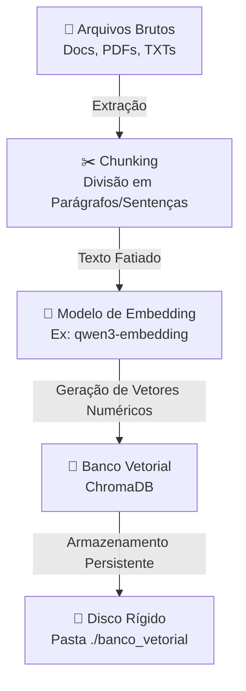
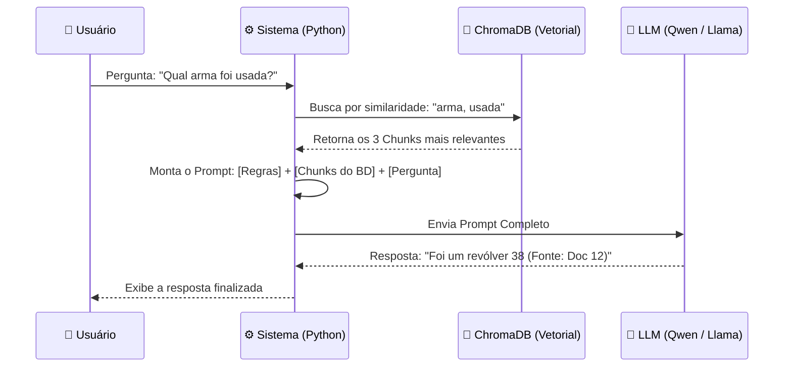
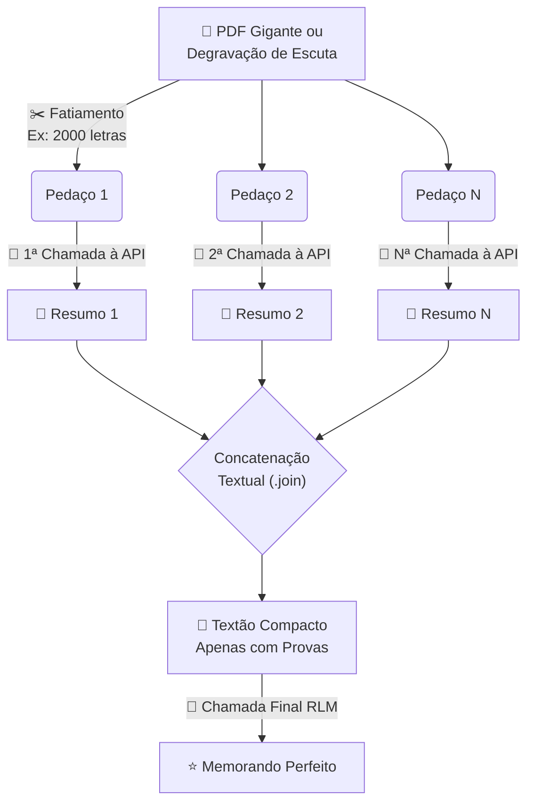

# Aula 3: Memória de Longo Prazo (RAG) e Sumarização Recursiva (RLM)

## Objetivo da Aula
- O foco desta aula foi resolver os dois maiores gargalos dos Modelos de Linguagem (LLMs): 
- O esquecimento (base de dados própria);
- O limite de tokens estruturais (amnésia em textos gigantes).

---

## Solução Arquitetural 1: RAG (Retrieval-Augmented Generation)

### 1. Implementação do Banco de Dados Vetorial (Cérebro Vetorial) (`main3_1.py`)

- A indexação é a etapa de ingestão de dados da arquitetura RAG (***Indexing***) e consite em transformar documentos brutos em vetores numéricos que podem ser consultados em tempo real.
- A consequência da indeaxação é que ao invés de o LLM tentar memorizar arquivos durante seu treinamento inicial, nós externalizamos essa memória para uma base de dados especializada que o LLM pode consultar em tempo real.

- Elementos do RAG:
- **ChromaDB (O Banco de Dados Vetorial)**: 
  - Diferente de bancos relacionais que buscam por palavras-chave exatas, bancos vetoriais armazenam e buscam conceitos pelo seu grau de similaridade geométrica.
  - Se você buscar por "Roubo de Carro", ele encontrará também "Subtração de Veículo", pois os valores matemáticos por trás dessas palavras é quase idêntica em um espaço multidimensional.
- **Embeddings (A Tradução Matemática)**: 
  - É o "tradutor" que transforma frases em texto humano para **representações matriciais densas** (uma lista de milhares de números, ex: `[0.12, -0.45, 0.99...]`).
  - Modelos como o `qwen3-embedding` conseguem ler um parágrafo inteiro de um inquérito e mapear sua exata "intenção" em coordenadas matemáticas dentro do ChromaDB.
- **Chunking (Fatiamento)**:
  - Refere-se às estratégias e aos limites de fragmentação de bases de conhecimento volumosas com garantia de precisão temática.
  - Evita que o ChromaDB retorne um documento inteiro, o que estouraria a janela de contexto da IA.
  - A qualidade de um RAG é inteiramente dependente de como você fatia o texto.
  - Existem 3 abordagens principais:
    1. **Chunking Estrutural (Linhas/Parágrafos):** O sistema divide o arquivo em quebras lógicas já existentes (ex: a cada nova linha `\n` ou a cada tag de cabeçalho). É perfeito para textos naturalmente bem formatados, como códigos de leis (separar por "Artigo" e "Inciso").
    2. **Chunking de Tamanho Fixo com Sobreposição:** O sistema fatia o texto a cada 500 letras, não importa o que esteja escrito. Para evitar que essa "faca cega" corte uma palavra importante ao meio ou perca o sentido temporal de uma frase, aplica-se o *Overlap* (copiar as últimas 50 letras do bloco anterior no início do bloco novo para amarrar o contexto).
    3. **Chunking Semântico Contextual:** A estratégia mais inteligente. Ferramentas avançadas (como os TextSplitters da biblioteca *LangChain*) leem a linguagem natural e garantem que o corte só aconteça no final real da sentença (depois do ponto final `.` ou interrogação `?`), protegendo a semântica de frases complexas.

#### **Fluxo de Criação do Banco de Dados Vetorial (Indexação)**



Exemplo de processo de fatiamento e indexação no ChromaDB:
```python
# 1. Configurando o Cliente do ChromaDB para persistir os dados na pasta do projeto
chroma_client = chromadb.PersistentClient(path="./banco_vetorial")

# 2. Configurando modelo de Embedding matemático para a tradução Texto -> Matemática
ollama_ef = embedding_functions.OllamaEmbeddingFunction(
    url="http://localhost:11434/api/embeddings", # URL do Ollama local
    model_name="qwen3-embedding:latest" # Modelo de Embedding matemático
)

# 3. Criar ou conectar a uma coleção ("tabela") no ChromaDB
# A coleção é o local onde os vetores (docs, embeddings, etc) são armazenados e consultados.
collection = chroma_client.get_or_create_collection(
    name="inqueritos_pcdf", # Nome da coleção
    embedding_function=ollama_ef # Função de Embedding matemático
)
# OBS: A qualidade de um RAG depende do fatiamento (chunking) do texto. 

# 4. CHUNKING BÁSICO: Dividindo o texto pelas suas quebras de linha "\n", ignorando vazios

'''
# ESTRATÉGIA A: Chunking Estrutural (Linhas/Parágrafos)
A função nativa split("\n") é fantástica para textos naturalmente divididos.
Exemplo: Arquivo `.txt` onde cada linha nova é o artigo de uma lei).
'''
chunks_estruturais = [p for p in texto_completo.split("\n") if p.strip()]

'''
# ESTRATÉGIA B: Chunking de Tamanho Fixo com Sobreposição (Overlap)
Usada na indústria quando o texto é um bloco maciço e quebrar por \n geraria falhas.
Fatiamos um trecho do tamanho fixo, mas 'sobrepomos' algumas palavras (Overlap) para que o sentido de uma frase não se perca no corte com a fatia seguinte.
'''
# Quantidade de caracteres
tamanho_bloco = 500
# Retiramos os 50 caracteres finais antes do próximo corte para manter coesão
overlap = 50
# Lista para armazenar os pedaços
chunks_tamanho = []
# Loop for que vai percorrer o texto completo e dividir em pedaços (tamanho_bloco)
# len(texto_completo) é o tamanho do texto, 
# tamanho_bloco - overlap é o tamanho do pedaço
for i in range(0, len(texto_completo), tamanho_bloco - overlap):
    # Adiciona o pedaço na lista chunks_tamanho
    chunks_tamanho.append(texto_completo[i: i + tamanho_bloco].strip())

'''
# ESTRATÉGIA C: Chunking Semântico Contextual
Em sistemas avançados, usaríamos um `TextSplitter` da biblioteca *LangChain*.
O LangChain "lê" a linguagem e corta o texto apenas no ponto final ("."), evitando que uma palavra seja cortada ao meio matematicamente como na Estratégia B.
'''
# Aplicação da Estratégia de Chuncks Estruturais para prosseguimento do cadastro
# É possível mudar a estratégia e tentar executar com a lista chunks_tamanho
documentos_finais = chunks_estruturais

# 5. GERANDO CHAVES ÚNICAS: Criando um ID artificial (rastreio) para cada pedaço
# Ex: Se foram gerados 100 pedaços, teremos ["doc_0", "doc_1", ... "doc_99"]
ids = [f"doc_{i}" for i in range(len(documentos_finais))]

# 6. UPSERT (Update/Insert): Injeção final no Banco Vetorial.
'''
O banco ChromaDB vai pegar a lista de 'documentos_finais' em texto, passá-la para o `ollama_ef` rodar e converter tudo em matrizes densas.
'''
collection.upsert(
    documents=documentos_finais,
    ids=ids
)
```

### 2. Consumo da Memória (`main3_2.py`)
A segunda metade da arquitetura RAG é executada quando o usuário faz uma pergunta para a IA. Em vez de enviar a pergunta direto para para o LLM (que não conhece o inquérito na delegacia), a pergunta é interceptada e o processo é dividido em duas etapas:

1. **Retrieval (Recuperação)**:
   - O sistema pega a pergunta do usuário e converte em embedding. 
   - Depois pesquisa no ChromaDB (banco vetorial) quais são os fragmentos (Chunks) salvos que têm a "distância geométrica mais próxima" (Cosine Similarity) em relação à pergunta.
   - O banco não devolve a resposta, ele devolve os *trechos do documento* que provavelmente contêm a resposta.
2. **Augmentation & Generation (Aumento de Contexto e Geração)**:
   - De posse dos trechos recuperados, o sistema "aumenta" o prompt (injetando esses textos como um anexo obrigatório de leitura).
   - Só então o modelo de IA entra em ação, gerando uma resposta gramaticalmente perfeita baseada *exclusivamente* no contexto anexado, impedindo a "alucinação" (invenção de provas).

#### Fluxo de Consumo RAG (Consulta)



Exemplo prático de consulta (Query) e montagem do Prompt:
```python
# PASSO A: Buscando blocos relevantes no banco de dados
# O ChromaDB possui um método '.query()' nativo para buscar os Chunks.
resultados = collection.query(
    # query_texts: Transforma a sua pergunta em um vetor instantâneo e joga no banco para achar os parecidos
    query_texts=[pergunta.texto], 
    
    # n_results: Define o "limite" de Chunks que vão voltar. 
    # Trouxemos apenas os 3 pedaços mais relevantes para não afogar o limite de leitura da IA
    n_results=3 
)

# A variável 'resultados' volta como um objeto complexo (dicionário de listas).
# Nós acessamos ['documents'][0] que é uma lista de textos e aplicamos a função join() do python para "colar" os 3 pedaços retornados em um único texto usando uma quebra de linha invisível "\n".
contexto_recuperado = "\n".join(resultados['documents'][0])

# PASSO B: Injetando o contexto restritivo (Augmentation) no LLM
# Usamos a formatação de string (f-string) para embutir a variável recuperada (contexto_recuperado) dentro das instruções fixas do Prompt de Sistema.
prompt_sistema = f"""
Você é um assistente de inteligência policial.
Responda à pergunta do usuário usando APENAS o contexto abaixo.
Se a resposta não estiver no contexto, diga "Não consta nos autos".

CONTEXTO DOS AUTOS:
{contexto_recuperado}
"""
```

---

## Solução Arquitetural 2: Recursive Language Mechanism (RLM)

### Map-Reduce para Textos (`main3_3.py`)

- **O Problema: O Limite da Janela de Contexto**:
  - Modelos de IA possuem um limite físico de memória de curto prazo (Janela de Contexto), o qual é medido em tokens.
  - Tentar forçar o LLM a ler um PDF inteiro de 100 páginas de uma vez gera duas falhas: ou ele recusa a requisição (estouro de limite), ou ele sofre do efeito **"Lost in the Middle"**, isto é, amnésia estrutural em que se lembra bem do início e do fim do texto, mas esquece do que estava no meio das 100 páginas.

- **1. Map-Reduce é um Paradigma Matemático Universal (A Estratégia)**:
  - O termo **Map-Reduce** nasceu muito antes das Inteligências Artificiais modernas. Foi criado pela Google nos anos 2000 para processar o motor de busca deles espalhado por milhares de servidores.
  - **Map:** Significa pegar um problema gigante (100 petabytes de dados) e "Mapear / Fatiar" em milhões de pedacinhos entregues para vários processadores lerem em paralelo.
  - **Reduce:** Significa pegar os resultados mastigados desses milhões de processadores e "Reduzi-los" (Sintetizar / Consolidar) na tela do usuário.
  - Na sua aula 3, nós apenas "emprestamos" e aplicamos essa estratégia velha de guerra do Google para resolver o problema de amnésia do ChatGPT fatiando listas grandes.

- **2. RLM (Recursive Language Mechanism) é uma Arquitetura Dinâmica de LLM (A Peça da IA)**:
  - RLM (Mecanismo de Linguagem Recursivo) refere-se intrinsecamente ao fato de você fazer uma IA invocar ela própria (ou seja, seu "Output/Saída" virar o seu novo "Input/Prompt") de forma cíclica (recursiva).
  - Temos RLM na etapa que a IA pega o "Resumo 1" e mastiga ele iterativamente junto com o "Resumo 2" para afinar o texto final da perícia.

- **O Veredito Prático (O Cruzamento dos dois)**:
  - É comum usar RLM como sinônimo de Map-Reduce de Textos porque o RLM é *a ferramenta que nós usamos para operacionalizar* um Map-Reduce de Textos.
  - Se tivéssemos implementado um "Map-Reduce Numérico", por exemplo, para somar planilhas financeiras, não teríamos usado IA, nem RLM. Teríamos usado matemática de CPU.
    - Contudo, como o objetivo era processar PDFs / Textos em Linguagem Natural, usamos a técnica RLM (LLMs chamando LLMs sequencialmente) para cobrir a área estratégica que o paradigma Map-Reduce exigia.

#### **Fluxo de Sumarização Recursiva (Map-Reduce)**



Exemplo prático de código aplicando Map-Reduce em Python:
```python
# =======================================================================
# 1. ETAPA MAP (MAPEAMENTO / FATIAMENTO NA ORIGEM)
# =======================================================================

# Criamos as fatias brutas do texto gigante baseadas numa constante de tamanho (ex: 2000 chars)
blocos = [texto_completo[i:i+TAMANHO_BLOCO] for i in range(0, len(texto_completo), TAMANHO_BLOCO)]

# Declarar lista vazia para armazenar as futuras respostas isoladas do LLM
resumos_parciais = []

# Loop for que vai processar e pedir pro LLM resumir de forma isolada CADA bloco do texto original
for bloco in blocos:
    # A função resumir_bloco() faz uma chamada rápida na API da IA passando apenas o trecho da vez
    # e nós adicionamos (.append) o resultado dessa chamada isolada na nossa lista 'resumos_parciais'
    resumos_parciais.append(resumir_bloco(bloco))


# =======================================================================
# 2. ETAPA REDUCE (REDUÇÃO / CONSOLIDAÇÃO FINAL)
# =======================================================================

# A engine Python vai pegar a lista cheia de micro-resumos filtrados e "colá-la" 
# em uma String unificada, separando os trechos por quebras de linha invisíveis "\n"
texto_consolidado = "\n".join(resumos_parciais)

# Enviamos todo esse texto (que agora é super compacto e sem "ruído" do arquivo original)
# de volta pro modelo de IA (LLM) processar uma ÚLTIMA VEZ para obter o Resumo/Memorando Perfeito
resumo_final = resumir_bloco(texto_consolidado)
```
