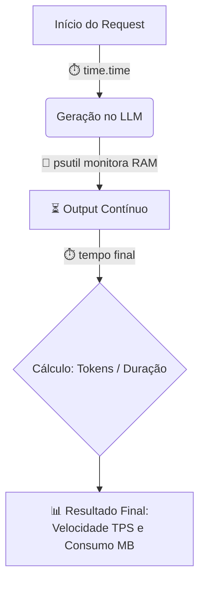
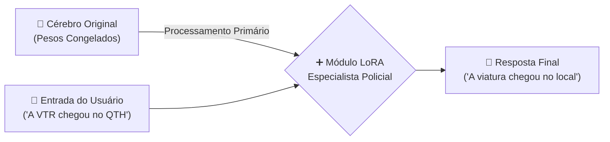

# Aula 4: Medição de Performance (Benchmarking) e Otimização de Modelos

## Objetivo da Aula

Avaliar o escopo prático e as métricas de Engenharia de Software ao usar IA, garantindo eficiência na velocidade, na proteção de memória e na previsibilidade computacional.

---

## Conceitos e Ferramentas Apresentadas

### 1. Benchmarking de LLMs (`main4_1.py`)

- **A Importância das Métricas em Engenharia de IA:**:
  - Se na Engenharia de Software tradicional, as APIs são medidas em milissegundos (latência de rede), por que não usar a mesma métrica (latência de rede) para medir a IA?
  - Porque na Engenharia de IA, o tempo total da resposta engana. Um modelo pode demorar 2 segundos gerando uma linha e 20 segundos gerando um laudo de 5 páginas. O motor tem a mesma eficiência de processamento, apesar da diferença abissal de tempo.
  - O gargalo real na IA não é a rede, mas o **processamento sequencial da placa de vídeo/CPU** (computação densa) e o consumo de Memória RAM para hospedar os bilhões de parâmetros na memória local.

- **As Ferramentas de Auditoria:**
  - **Biblioteca `time` (Métrica de Inferência):**
    - Funciona como um cronômetro hiper-preciso que liga exatamente antes de a IA começar a "pensar" e desliga assim que ela entrega a última palavra.
    - Isolamos essa métrica do resto do aplicativo (ex: sem contabilizar o tempo de clique no front-end).
  - **Biblioteca `psutil` (Métrica de Hardware):**
    - Identifica o `PID` (Process ID) exato do interpretador Python rodando no sistema operacional e extrai em Megabytes (MB) o tamanho de RAM que a IA inflou na máquina no momento exato da chamada.

- **A Métrica Universal da Indústria (Tokens por Segundo - TPS)**:
  - Para criar uma métrica estabilizada e justa (sem se importar se o texto final é um artigo inteiro ou uma simples saudação), o mercado utiliza o **TPS (Tokens/s)**, que divide o total do tamanho resposta pela duração em segundos.
  - O **TPS (Tokens/s)** é a velocidade inquestionável com que a IA gera texto, servindo para planejar a experiência do usuário final.

#### **Fluxo de Benchmarking Isolado**



Exemplo prático de script de benchmark de recursos:
```python
# =======================================================================
# 1. FUNÇÃO DE AUDITORIA DE HARDWARE
# =======================================================================
def medir_recursos():
    # os.getpid() descobre o "RG do processo" do script Python rodando no Sistema Operacional.
    # psutil.Process() entra no gerenciador de tarefas (Task Manager) rastreando este PID específico.
    process = psutil.Process(os.getpid())
    
    # memory_info().rss retorna os bytes alocados (Resident Set Size).
    # Dividimos por 1024 duas vezes para converter de Bytes para Kilobytes e depois para Megabytes (MB).
    return process.memory_info().rss / 1024 / 1024

# =======================================================================
# 2. CÔMPUTO DIRETO DO TEMPO DE GERAÇÃO (INFERÊNCIA)
# =======================================================================

# 1. Batemos o ponto exato no relógio milissegundo antes da IA ser acionada
start_time = time.time()

# 2. Chamamos o LLM para trabalhar intensamente (A Thread é bloqueada aguardando o fim)
response = client.chat.completions.create(...)

# 3. Calculamos a Duração: Hora do término exato menos a hora da partida guardada
duration = time.time() - start_time

# =======================================================================
# 3. CÁLCULO DE VELOCIDADE PURA (TPS - Tokens Por Segundo)
# =======================================================================

# Como um Token semântico é ligeiramente menor que uma palavra na língua portuguesa, separamos a resposta em palavras inteiras e multiplicamos por '1.3' (Média do tamanho do token BR).
num_tokens = len(resposta.split()) * 1.3

# Dividimos a "quantidade teórica de peças/tokens gerados" pelo "tempo transcorrido".
velocidade = num_tokens / duration
```

### 2. Fine-Tuning e LoRA (`main4_2.py`)

- **O Desafio do Fine-Tuning Clássico**:
  - Treinar uma IA inteira do zero (Full Fine-Tuning) para ensinar novos termos ou comportamentos custa milhões de dólares, destrói conhecimentos anteriores e exige supercomputadores com vasta memória de vídeo (VRAM).
- **A Solução (LoRA - Low-Rank Adaptation)**:
  - É uma técnica matemática inteligente ("Adaptação de Baixo Posto").
  - Em vez de treinar todos os bilhões de neurônios da IA, o LoRA não altera o cérebro original, mas treina apenas um minúsculo "módulo anexo" (pesos periféricos adaptativos) que consome pouquíssima memória.
  - É como acoplar um "pendrive jurídico" à IA para que ela se especialize instantaneamente.
- **A Prática no Script (Simulação via Prompt)**:
  - No código, simula-se (arquiteturalmente) o efeito de "Injeção de Conhecimento Rápido" do LoRA usando Prompt Especializado denso, forçando o comportamento de glossário antes que o LLM dê sua resposta, sem quebrar a rede interconectada original.

#### **Fluxograma de Arquitetura LoRA**



Exemplo prático de Injeção de Especialização:
```python
# =======================================================================
# SIMULAÇÃO DE COMPORTAMENTO LORA (FINE-TUNING VIA PROMPT)
# =======================================================================

# Criamos uma string literal múltipla (""") que atua como uma injeção comportamental fixa.
# Esta técnica avança além do 'Zero-Shot', simulando na prática de engenharia de software 
# Os resultados são extremamente rígidos e parecidos com o que um módulo LoRA autêntico entregaria.
prompt_especializado = """
Você é um Especialista em Terminologia Policial da PCDF (Modelo Fine-Tuned).
Sua função é traduzir jargões técnicos para linguagem civil formal.

Glossário Interno Definitivo:
- VTR: Viatura
- Simulacro: Arma falsa
- QTH: Local da ocorrência
- APF: Auto de Prisão em Flagrante

Traduza o relato do plantão criminal mantendo o tom jurídico adequado.
"""
```

### 3. Biblioteca Nativa do Ollama (`main_a.py` e `main_b.py`)

- **O Problema das Bibliotecas Genéricas (OpenAI Engine)**:
  - Na Aula 1, priorizamos o uso do `openai-python-client` conectado ao Ollama local para evitar o aprisionamento tecnológico (*Vendor Lock-in*).
  - Isso é excelente para a universalidade do código, mas clientes flexíveis e genéricos enfrentam dificuldades para repassar variáveis rígidas (Low-Level) do hardware até o servidor Ollama, podendo sofrer desvios na resposta.
- **A Solução e Vantagem Estrita (Biblioteca `ollama`)**:
  - A biblioteca oficial do Ollama atua por debaixo dos panos diretamente com as entranhas da máquina (Localhost).
  - Isso nos permite definir variáveis estruturais intransigíveis, por exemplo, o uso do parâmetro `format='json'`, que força o LLM a devolver uma resposta parsiável como um objeto JSON em Python, sem risco da aplicação web quebrar.

Exemplo de uso contornando a arquitetura OpenAI puro para exigir Formatação Estrita:
```python
# Importa o SDK nativo do Ollama que acessa o servidor de IA local diretamente
import ollama

# Biblioteca nativa do Python para manuseio de strings e conversão para varíaveis do tipo dicionário
import json

# =======================================================================
# EXECUÇÃO DA INFERÊNCIA COM FORÇANTE LOW-LEVEL
# =======================================================================

# Utilizamos o endpoint ollama.chat (em vez do client.chat.completions genérico)
response = ollama.chat(
    model='qwen2.5:3b', # Define o modelo específico em execução no servidor (PID)
    messages=[
        {'role': 'system', 'content': SYSTEM_PROMPT}, # A personalidade/regra
        {'role': 'user', 'content': f"Classifique: {noticia.text}"} # A entrada viva a ser julgada
    ],
    
    # MÁGICA NATIVA (O JSON FORCING PURO): 
    # Este argumento intercepta a saída e recusa respostas textuais humanas ("Olá, claro!"), travando o processamento do LLM para devolver apenas matrizes JSON brutas.
    format='json'
)

# =======================================================================
# EXTRAÇÃO E CONVERSÃO
# =======================================================================

# A resposta da biblioteca nativa chega envelopada em um Dicionário.
# Nós isolamos o '.content' puro e usamos json.loads() para converter a resposta textual da IA em um Objeto Python nativo (parsiável no Backend).
resultado_ia = json.loads(response['message']['content'])
```
