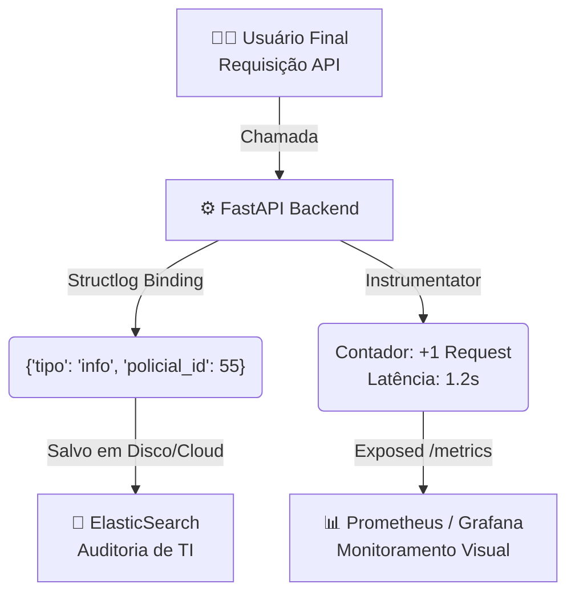
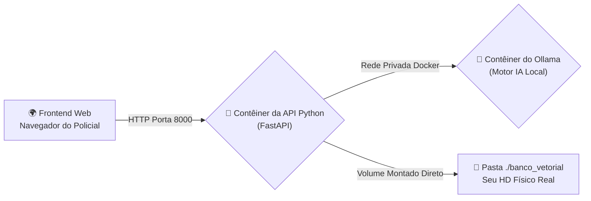

# Aula 5: Preparação para Produção (Deploy, Auditoria e Monitoramento)

## Objetivo da Aula
Demonstrar a solução arquitetural de software para a transição do ambiente de desenvolvimento para o ambiente de produção, aplicando práticas de observabilidade, segurança no tratamento de falhas e empacotamento conteinerizado visando implantações em ambientes sensíveis (Polícia Civil).

---

## Soluções Sistêmicas para Produção (PROD)

### 1. Logs Estruturados Profissionais (`structlog`)

- **O Problema do `print()` Comum**: 
  - Em laboratório, usar `print("Deu erro no banco")` na tela do console é aceitável.
  - Em produção (servido para milhares de policiais), esses textos puros se perdem no servidor.
  - Sistemas de auditoria (como Kibana/Elasticsearch ou CloudWatch) não conseguem criar alertas se toda mensagem possui um formato de texto humano diferente.
- **A Solução (Logs JSON Estruturados)**:
  - A biblioteca `structlog` substitui os textos soltos por **objetos JSON altamente padronizados**. 
  - Toda ação (erro, info, warning) carrega marcações de tempo exatas (`2026-03-01T21:00:00Z`), fuso horário normalizado e formato computacional inquebrável.
- **Vantagem Tática (Binding Contextual):** 
  - O "Binding" é a capacidade de **injetar rastreadores fixos** no registro.
  - Se o Policial Silva (ID 55) começar uma análise, o sistema insere o ID 55 no log.
  - Todas as 5.000 linhas de código que rodarem dentro do sistema após isso irão anexar silenciosamente a tag `{"policial": "55"}`, permitindo rastrear o culpado de um ataque cibernético até a mesa dele.

#### **Fluxo de Observabilidade (Logs & Métricas)**


Exemplo prático de configuração e injeção do Log Estruturado:
```python
import structlog

# =======================================================================
# 1. SETUP DE COMPILADORES DO LOG (Configuração Global)
# =======================================================================
# Definimos as engrenagens mestras do Structlog para o projeto inteiro.
structlog.configure(
    processors=[
        # Injeta um carimbo de tempo inviolável no formato internacional ISO-8601 associado a UTC.
        structlog.processors.TimeStamper(fmt="iso"), 
        
        # O renderizador final: Transforma os argumentos Python em formato JSON bruto de máquina.
        structlog.processors.JSONRenderer()
    ]
)
# Instanciamos o objeto logador raiz.
logger = structlog.get_logger()

# =======================================================================
# 2. APLICAÇÃO NO FLUXO DE REQUISIÇÃO (Binding)
# =======================================================================
# Imagine que o usuário bateu na rota da API. Nós "grampeamos" rastreadores eternos 
# neste ciclo de vida: o ID do Policial que fez a requisição e o IP do seu computador.
log = logger.bind(policial=bo.policial_id, ip=request.client.host)

# Qualquer invocação doravante (.info, .error, .warn) arrastará as amarras acima.
# Registramos a ação principal ("analise_iniciada") e uma métrica de volume de dados (tamanho_texto).
log.info("analise_iniciada", tamanho_texto=len(bo.relato))
```

### 2. Instrumentação e Monitoramento (`prometheus-fastapi-instrumentator`)

- **O Conceito de "Exporters"**: 
  - Ninguém entra no servidor via terminal para checar se a API está "suportando o tranco".
  - Ferramentas como o Prometheus injetam contadores numéricos atômicos no coração do FastAPI (Latência P99, Quantidade de Requests/Seg, Contagem de Falhas HTTP 500) e os "raspam" ("*Expose*") através de uma rota aberta chamada `/metrics`. Telões gerenciais (Grafana) sugam esses números a cada 5 segundos para gerar gráficos maravilhosos exibidos no NOC da corporação.

Exemplo de Instrumentação do FastAPI em duas linhas:
```python
# Importamos a biblioteca ponte de compatibilidade
from prometheus_fastapi_instrumentator import Instrumentator

app = FastAPI(title="IntelliDoc PCDF - PROD")

# =======================================================================
# HABILITAÇÃO DO MONITORAMENTO GLOBAL
# =======================================================================
# '.instrument(app)' -> Abraça todos os endpoints do FastAPI injetando cronômetros e contadores neles
# '.expose(app)' -> Cria automaticamente a rota interna "http://localhost:8000/metrics" 
# que vai exibir a folha numérica padronizada para o servidor do Prometheus raspar.
Instrumentator().instrument(app).expose(app)
```

### 3. Tratamento Seguro contra Falhas (`try / except` em Prod)

- **Segurança da Informação e Camuflagem**: 
  - Na programação estudantil, quando um código "quebra", ele exibe letras vermelhas enormes com o caminho completo até a falha (`/home/user/app/banco/senha.py`).
  - Em produção, isso é **Vazamento Crítico de Stacktrace**. Um hacker forceja um erro para ler a rota privada dos seus servidores. O bloco Seguro engaiola a falha e escreve o "erro de verdade" no JSON interno (invisível à Web), mas retorna um "band-aid verbal genérico" e dócil para a tela do cibercriminoso/usuário final.

Exemplo estrutural de fuga limpa e contida:
```python
try:
    # Tentativa de rodar a IA (Suscetível a queda de link, timeout, explosão de memória)
    response = client.chat.completions.create(...)
    return {"classificacao": resposta, "status": "ok"}

except Exception as e:
    # 1. AUDITORIA: Salva o erro verdadeiro e letal APENAS no disco interno do seu servidor 
    # engarrafado pelo Structlog (Usando a flag reservada 'e'). Hacker não vê isso.
    log.error("erro_processamento_ia", erro_nativo=str(e))
    
    # 2. FRONT-END: Devolve uma camuflagem civilizada pro site/aplicativo. 
    # Nunca exponha falhas de bibliotecas SQL ou AI para o usuário da ponta.
    return {"status": "erro", "mensagem": "Falha interna no motor neural. A equipe de TI foi notificada."}
```

### 4. Orquestração e Conteinerização (Docker & Docker Compose)

- **O Problema do "Na minha máquina funciona"**:
  - Seu projeto Python pode rodar magistralmente no seu Windows com a versão 3.10.4, mas quando a equipe de implantação joga no RedHat Linux Corporativo antigo (versão 3.6), absolutamente todas as bibliotecas entram em colapso.
- **A Solução (Contêineres)**:
  - O Docker cria um mini-Sistema Operacional independente blindado apenas para o seu App. Ele empacota o Ubuntu, o Python correto, suas pastas de fotos e os instaladores (o `requirements.txt`). Ele roda em caixas lacradas virtualizadas e a prova de defeitos externos. O `Docker Compose` serve para levantar múltiplas dessas caixas ao mesmo tempo, já "cabeando-as" com rede interna (Ex: o contêiner da _Sua API Python_ se conectando ao contêiner de _Banco Vetorial ChromaDB_ que está se conectando ao contêiner do _Ollama_).

#### **Arquitetura de Contêineres (Docker Compose)**


Exemplo padrão de **`Dockerfile`** (A 'Planta-Baixa' do seu mini-S.O. Python):
```dockerfile
# 1. FUNDAÇÃO: Pega uma imagem enxuta do Linux já com o exato Python que codamos
FROM python:3.11-slim

# 2. DEFINIÇÃO TERRITORIAL: Cria a pasta de trabalho '/app' dentro da caixa forte do mini-S.O.
WORKDIR /app

# 3. CACHE TRICK (O Pulo do Gato): Copiamos apenas a lista de dependências primeiro.
# Como bibliotecas demoram minutos para baixar, o docker armazena localmente.
COPY requirements.txt .

# Executa e manda instalar blindando contra caches corrompidos pip
RUN pip install --no-cache-dir -r requirements.txt

# 4. CÓDIGO FONTE FINAL: Só agora empurramos a pasta inteira do nosso computador pro mini-Linux.
COPY main5-1.py main.py

# 5. PASSARELA: Avisamos o maquinário externo para liberar a porta 8000 deste contêiner pro mundo exterior
EXPOSE 8000

# 6. GATILHO (CMD): Define o comando brutal de linha de comando que rodará na hora que a caixa "Ligar"
CMD ["uvicorn", "main:app", "--host", "0.0.0.0", "--port", "8000"]
```

Exemplo prático de Orquestração Múltipla via **`docker-compose.yml`**:
```yaml
# A versão do padrão escritural do arquivo 
services:
  # SERVIÇO 1: O NOSSO CÓDIGO (FastAPI)
  api:
    # Fala pro compose ler o Dockerfile acima (na pasta local '.') e construir ali na hora
    build: .
    
    # Mapeamentos de Porta (Porta_MundoFora : Porta_MiniSO_Interno)
    ports:
      - "8000:8000"
      
    # Injetamos a variável que o SDK do Python exigirá para achar a API cruzando rede
    # Em vez de 'localhost', ela acessa a caixinha amiga vizinha com o nome 'ollama' da linha 119
    environment:
      - OLLAMA_URL=http://ollama:11434/v1
      
    # Obrigamos o Compose a esperar o motor do Ollama subir antes de tentar ligar nós mesmos
    depends_on:
      - ollama

  # SERVIÇO 2: O MOTOR DE IA FECHADO DA INTERNET
  ollama:
    # Pega uma imagem pronta baixada universal do DockerHub 
    image: ollama/ollama:latest
    ports:
      - "11434:11434"
      
    # VOLUME: Faz um buraco espacial ('Wormhole') ligando a pasta do HD da nossa máquina (ollama_data)
    # Direto nas entranhas internas do Ollama (/root/.ollama) para não perdermos modelos qwen 
    # bilionários toda vez que a caixa for destruída e recriada.
    volumes:
      - ollama_data:/root/.ollama
```